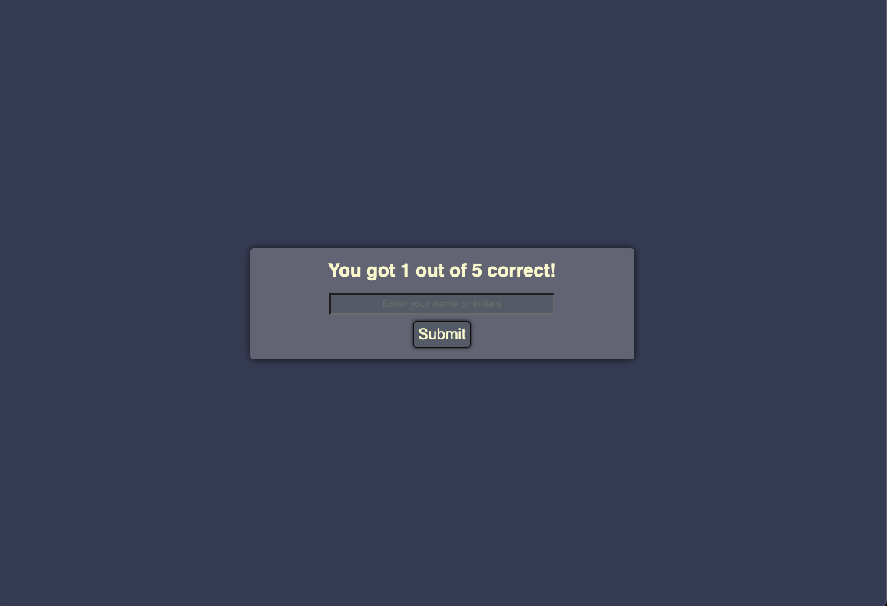

# coding-quiz

## Description

The objective of this challenge is to build a simple coding quiz from scratch.

\
User Story
```
AS A coding boot camp student
I WANT to take a timed quiz on JavaScript fundamentals that stores high scores
SO THAT I can gauge my progress compared to my peers
```

\
Acceptance Criteria
```
GIVEN I am taking a code quiz
WHEN I click the start button
THEN a timer starts and I am presented with a question
WHEN I answer a question
THEN I am presented with another question
WHEN I answer a question incorrectly
THEN time is subtracted from the clock
WHEN all questions are answered or the timer reaches 0
THEN the game is over
WHEN the game is over
THEN I can save my initials and score
```

## Process

1. Built HTML file to hold all the components of the quiz
   - Included a container, holding sections for the start page, the quiz, gameover page, and the highscore page.
  
2. Styled the HTML with CSS
3. Created a JS file to provide functionality to the quiz.
   
    Created variables: 
  
    ```
    var quizBody = document.getElementById("quiz");
    var resultsEl = document.getElementById("result");
    var finalScoreEl = document.getElementById("final-score");
    var gameoverDiv = document.getElementById("gameover");
    var questionsEl = document.getElementById("questions");
    var quizTimer = document.getElementById("timer");
    var startPageContainer = document.getElementById("start");
    var startQuizButton = document.getElementById("start-button");
    var startQuizDiv = document.getElementById("startpage");
    var highscoreContainer = document.getElementById("highscore-container");
    var highscoreDiv = document.getElementById("highscore-page");
    var highscoreInputName = document.getElementById("name-or-initials");
    var highscoreDisplayName = document.getElementById("highscore-initials");
    var highscoreDisplayScore = document.getElementById("highscore-score");
    var endGameBtns = document.getElementById("end-buttons");
    var submitScoreBtn = document.getElementById("submit");
    var buttonA = document.getElementById("a");
    var buttonB = document.getElementById("b");
    var buttonC = document.getElementById("c");
    var buttonD = document.getElementById("d");
    var quizQuestions;
    ```

    Created functions:

    ```
    generateQuizQuestion();
    startQuiz();
    showScore();
    generateHighscores();
    showHighscore();
    clearScore();
    replayQuiz();
    checkAnswer(answer);
    ```

## Screenshots





## Links
<a href="https://devinlachnicht.github.io/coding-quiz/" target="_blank">Deployed Application</a>